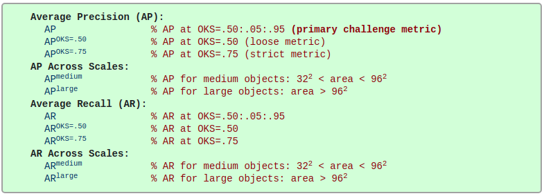

##### 3D human pose datasets

- [Human3.6M](http://vision.imar.ro/human3.6m/description.php), 2014

  + Diversity and Size

    (1) 3.6 million 3D human poses and corresponding images

    (2) 11 professional actors (6 male, 5 female)

    (3) 17 scenarios (discussion, smoking, taking photo, talking on the phone...)

  + Accurate Capture and Synchronization

    (1) High-resolution 50Hz video from 4 calibrated cameras

    (2) Accurate 3D joint positions and joint angles from high-speed motion capture system

    (3) Pixel-level 24 body part labels for each configuration

    (4) Time-of-flight range data

    (5) 3D laser scans of the actors

    (6) Accurate background subtraction , person bounding boxe

  + MPJPE(mean  per joint position errors) evaluation metric

- [MPI-INF-3DPH](http://gvv.mpi-inf.mpg.de/3dhp-dataset/), 2014

  (1) includes both indoor and outdoor scenes, contains 2929 frames from 6 subjects performing 7 actions. 

- [HumanEva](http://humaneva.is.tue.mpg.de/)

- [Unite The People](http://files.is.tuebingen.mpg.de/classner/up/)

##### 2D human pose datasets

- [MPII Human Pose](http://human-pose.mpi-inf.mpg.de/#overview) , 2014

  (1) around 25K images containing over 40K people with annotated body joints.

  (2) covers 410 human activities and each image is provided with an activity label.

  (3) test set, richer annotations including body part occlusions and 3D torso and head orientations.

  (4) 20 activity categories, and each activity category containing more specific activities. 

  (5) annotations:

  + Observer-Centric(OC) annotations
  + Person-Centric(PC) annotations
  
  (6) evaluation metrics:
  
  + single person: PCK, PCKh, PCKh@0.5
  + multiple person: mAP, mAP@0.5
  + PCP

- [COCO Keypoint](http://cocodataset.org/#home), 2017

  (1) train, validation, test sets: more than 200,000 images abd 250,000 person instances labeled with keypoints. annotations on train and val with over 150,000 people and 1.7 million labeled keypoints.

  (2) test set is divided into two splits: test-dev and test-challenge.

  (3) [COCO API](https://github.com/cocodataset/cocoapi),   [statement](http://cocodataset.org/#download)

  (4) [data format](http://cocodataset.org/#format-data)

  (5) [results format](http://cocodataset.org/#format-results)

  (6) [keypoint evaluation metrics](http://cocodataset.org/#keypoints-eval):

  + object keypoint similarity (OKS), ground truth keypoints form [x1,y1,v1,...,xk,yk,vk], v=0: not  labeled, v=1: labeled but not visible, v=2: labeled and visible. 
    $$
    OKS=\sum_{i}{[exp(-d_i^2/2s^2k_i^2)\delta(v_i>0)]/\sum_{i}{[\delta(v_i>0)]}} \\
    d_i是真值与预测值之间的欧氏距离，v_i是真值的可见度标志，将d_i通过标准方差为sk_i的高斯分\\布，s是物体比例系数，定义为目标分割区域的平方根，k_i是控制衰减的每个关键点常数。每个关\\键点产生一个介于0-1之间的关键点相似度，相似度是所有标注过的关键点的平均值(v_i>0的\\关键点)，未标记的(v_i=0)的预测不会影响OKS。完美的预测OKS=1,所有关键点预测偏离\\多个方差sk_i将会具有OKS约等于0，有了OKS，可以计算AP和AR。
    $$
    
+ Average Precision (AP)
  
  
  
  
  
- [Ai-Challenger](https://challenger.ai/dataset/keypoint)

  (1) training set, evaluation set, test A, test B: 210,000 images, 30,000 images, 30,000 images, 30,000 images.

  (2) 骨骼关键点标注有14个，关键点有三种状态：可见、不可见、不在图内或不可推测。 

- [Penn Action Dataset](http://dreamdragon.github.io/PennAction/)

  (1) contains 2326 video sequences of 15 different actions and human joint annotations for each squence.

  (2) resolution size 640x480

  (3) include some sport activities: baseball pitch, clean and jerk, pull ups,  strumming guitar, baseball swing, golf swing, jump rope...

  (4) totally 13 joints

  (5) [提供人体关键点标注工具](http://dreamdragon.github.io/vatic/)

- [LSP](http://sam.johnson.io/research/lsp.html)

- [FLIC](https://bensapp.github.io/flic-dataset.html)

- [FLIC-plus](https://jonathantompson.github.io/)