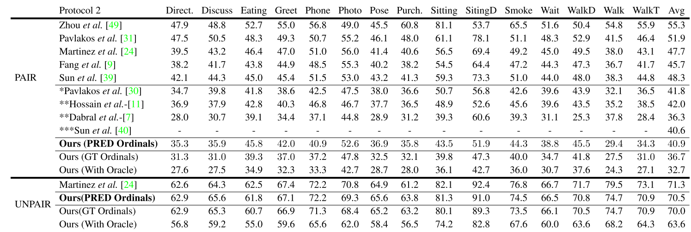

#### Monocular 3D Human Pose Estimation by Generation and Ordinal Ranking, ICCV2019

##### 主要贡献

- 基于深度生成模型，利用估计的2D姿态，得到多种3D姿态样本，减少从2D到3D的歧义
- 首次将深度条件变量自编码应用到3D姿态估计中
- 从RGB图像中获取关节-方向关系，并展示他们对3D姿态排序的用法
- 使用oracle，在Human3.6M和Human-Eva上得到SOTA效果
- 即使使用没有图像的MoCap库进行训练，2D-3D模型仍然可以表现良好，表现出域位移和缺乏3D图像的鲁棒性

##### 模型

##### 细节

- 2DPoseNet：从图像中获取2D关键点位置，使用Stacked Hourglass Model(two stacks)模型获取每个关键点的heatmap

- MultiPoseNet：从2D得到多种3D姿态，使用[CVAE](https://papers.nips.cc/paper/5775-learning-structured-output-representation-using-deep-conditional-generative-models.pdf)中的训练方法，模型实现图如下：

  

- OrdinalNet：从图像到关键点的顺序关系，每两个关节的深度关系构成16x16的深度矩阵

- OrdinalScore：评分并汇总生成的3D样本，高分数和低分数样本汇总，增强数据多样性

- 在Human3.6M上基于MPJPE 评价指标的3D姿态估计误差，protocol1(training set: s1, s5, s6, s7, s8; test set: s9, s11)

  

- 在Human3.6M上基于MPJPE 评价指标的3D姿态估计误差，protocol2(training set: s1, s5, s6, s7, s8,s9; test set: s11)

  

- 在HumanEva-I上基于reconstruction error 评价指标的3D姿态估计误差，protocol(training set: s1,s2,s3; test set: jogging, walking, evaluation set)

  

##### 总结

利用自动编码-解码器

